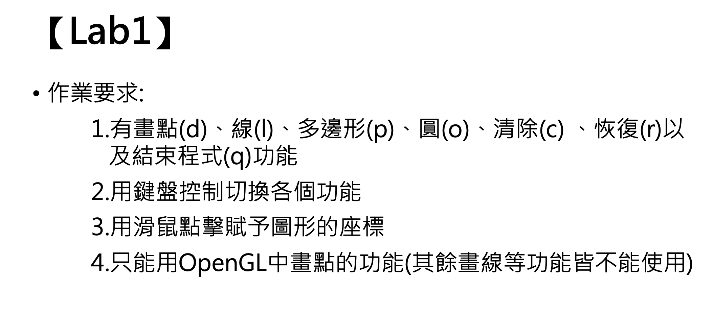

# Asssignment 1



## Compile c++ file

```
// macos
g++ -g ./lab1.cpp -o ./lab1 -framework OpenGL -framework GLUT
```

## Run

```
./lab1
```

##

1. 畫點(d):

   - size:1
   - color:紅色

2. 滑鼠左鍵按下時畫

   - 線(l):
   - size:1
   - color:綠色
   - 滑鼠左鍵第一下是起點，第二下是終點
   - 以向量搭配 x, y 變化量用點畫線

3. 多邊形(p):

   - size:1
   - color:藍色
   - 滑鼠左鍵第一下是起點，第二下以後會連線上一個點
   - 以向量搭配 x, y 變化量用點畫線

4. 圓(o):

   - size:1
   - color:黃色
   - 滑鼠左鍵點擊為圓心 放開為半徑
   - 使用八分畫圓法用點畫圓

5. 清除(c):

   - 隱藏所有圖形

6. 恢復(r):

   - 顯示所有圖形

7. 結束程式(q):

   - 關閉視窗，並且結束程式
