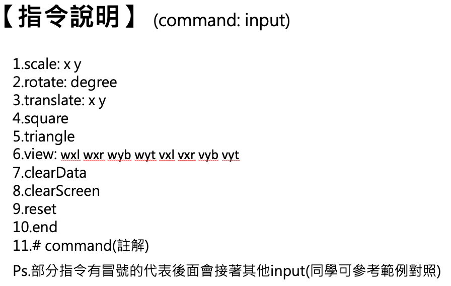

# Asssignment 2




## Compile c++ file

```
// macos
g++ -g ./lab2.cpp -o ./lab2 -framework OpenGL -framework GLUT
```

## Run

```
./lab2 ./lab2A.in
```

## 程式說明

1. 一開始先讀指令操作檔案，放入全域變數。開啟 glut 視窗。

2. 每次執行完 display 函數後會呼叫 glutPostRedisplay 函數，就會再次執行 display 函數。

3. display 函數

   - 會去看現在 screen 全域變數這個陣列，有哪些東西要畫。

   - 會去執行 parseCommand 這個函數來執行指令操作。

4. parseCommand 函數

   - 每次執行一行指令。

   - 根據不同指令 handle 不同東西。

5. handleScale, handleRotate, handleTranslate 函數

   - 將全域變數的 3x3 陣列 "matrix" 做左乘運算。

   - 處理縮放、旋轉、位移

6. handleSquare, handleTriangle 函數

   - 將當前的 3x3 矩陣和圖形種類丟入 datas 全域變數陣列

7. handleView 函數

   - 處理 window-viewport-mapping 的東西

   - 將 datas 陣列裡面的 3x3 矩陣拿出來做 viewport 處理，算出投影後座標。

   - 呼 polygon_clip 函數 將座標超出 viewport 邊界的裁切掉，算出新座標。

   - 將處理後的圖形丟入 screen 陣列，讓 display 函數畫。

8. polygon_clip 函數

   - 根據 左下右上 的順序裁切圖形座標。

   - 需要時呼叫 getMid 函數 取得和 viewport 邊界相交的點。

9. handleReset, handleClearData, handleClearScreen 函數

   - 初始化陣列、清空 datas 陣列、清空 screen 陣列

10. handleComment 函數

    - 印出註釋

11. handleEnd 函數

    - 關掉視窗 & 結束程式

## Reference

1. 上課筆記

2. [Introduction to Computer Graphics : Two-dimensional viewing](http://www.piegl.com/Team_Benjamin_Pres.pdf)

3. [Sutherland-Hodgman Polygon Clipping Youtube](https://www.youtube.com/watch?v=aZhQyqo9N6A)
